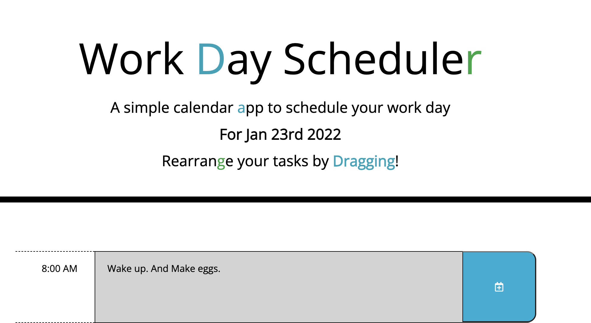

# Hourly Work Day Scheduler

Made with Javascript, Jquery, Bootstrap, and Moment Js!

https://mrsumada.github.io/hourly-workday-scheduler/

## How to Use

* Just click on any "Timeblock" to add your task for that hour. If you'd like to save your tasks, hit a Save Button located to the right of the tasks. 

* If you'd like to reschedule a task for a different hour, simply drag that block and drop it over the new hour. When you drop it, your task will switch to it's new Timeblock!

* And use the color code to always know which Timeblock is in the present.  The grey blocks indicate the past, the green blocks indicate the future, and the red block is the current hour. So get on that current task!

-Adam
